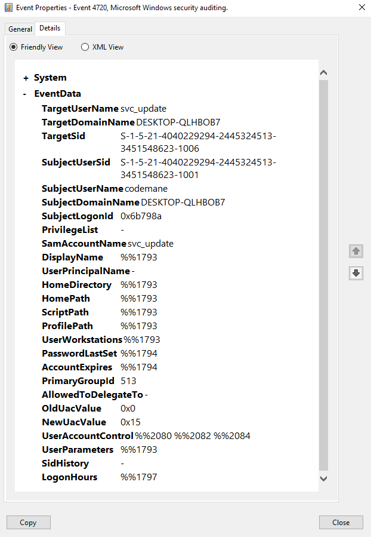

# Incident Report: Unauthorized Local Account Creation and Privilege Escalation

**Report ID:** INC-2026-08-12-01
**Classification:** Internal — Lab Exercise
**Exercise premise:** the account creation and privilege escalation were performed deliberately on this lab's own endpoint to generate the evidence analyzed here. The report is written from the position of an analyst who encounters the resulting events without that context — the reasoning, triage, and escalation decision reflect what the Security Event Log alone supports, which is the point of the exercise.
**Framework:** NIST SP 800-61 Rev 2, *Computer Security Incident Handling Guide* — withdrawn April 3, 2025 and superseded by [Rev 3](https://doi.org/10.6028/NIST.SP.800-61r3); cited here as the historical basis for this report's structure. See [`CSF_MAPPING.md`](CSF_MAPPING.md) for this report mapped to CSF 2.0.
**Severity:** High
**Status:** Escalated — Pending L2 Investigation

---

## 1. Executive Summary

On August 12, 2026, a local Windows account (`svc_update`) was created on a domain-joined endpoint (`DESKTOP-QLHBOB7`) and immediately added to the local `Administrators` group, granting it full administrative control of the machine. Both actions were attributed to the machine's own known local administrator account (`codemane`) — but attribution to a legitimate account does not confirm legitimate intent, since a compromised administrator session would produce identical evidence. In a live environment, the next Tier 1 step would be out-of-band verification with the account owner; this lab has no independent party to query, so that step is reasoned about hypothetically rather than performed. Given confirmed privilege escalation, an account whose authorization cannot be established from the available evidence, and no supporting change record, this incident is assessed as High severity and escalated to SOC Tier 2 for deeper investigation rather than closed at Tier 1.

## 2. Timeline of Events

All times local (EDT), sourced directly from Windows Security Event Log entries — not estimated.

| Time | Event | Source |
|---|---|---|
| 11:38:06 AM | Local account `svc_update` created | Event ID 4720 |
| 11:38:06 AM | `svc_update` added to default `Users` group (automatic, on creation) | Event ID 4732 |
| 11:38:12 AM | `svc_update` added to `Administrators` group | Event ID 4732 |

The six-second gap between account creation and the `Administrators` addition reflects two separate, deliberate command executions rather than a single automated action — consistent with an operator (human or scripted) manually escalating a freshly created account, not a bulk provisioning process. Both `Administrators` group events (`TargetSid S-1-5-32-544`) and `Users` group events (`TargetSid S-1-5-32-545`) were confirmed directly via full Event Detail review, not inferred from the summary list.


## 3. Indicators of Compromise

| Indicator | Value |
|---|---|
| Account name | `svc_update` |
| Account SID | `S-1-5-21-4040229294-2445324513-3451548623-1006` |
| Host | `DESKTOP-QLHBOB7` |
| Subject account (creator) | `codemane` |
| Subject SID | `S-1-5-21-4040229294-2445324513-3451548623-1001` |
| Target group | `Administrators` (Builtin, SID `S-1-5-32-544`) |
| Password state | `PasswordLastSet` shows `<never>` (`%%1794`) in the 4720 event — expected for a newly created account, and not an indicator on its own |

The account name itself is a soft indicator worth noting: `svc_update` follows a legitimate-looking service-account naming convention, the kind of name designed to blend into normal administrative activity rather than draw attention — a real, common tradecraft pattern for persistence accounts, not proof of malicious intent on its own.



## 4. MITRE ATT&CK Mapping

| Technique | ID | Tactic |
|---|---|---|
| Create Account: Local Account | T1136.001 | Persistence |
| Account Manipulation | T1098 | Persistence |

## 5. Triage & Severity Assessment

**Severity: High.** This assessment rests on completed impact — not a suspicious attempt. Both the account creation and the privilege escalation are confirmed directly in the Windows Security Event Log: the 4720 event records the account's creation, and the 4732 event records its addition to the `Administrators` group (`TargetSid S-1-5-32-544`), both reviewed in full Event Detail rather than inferred from the summary list. A newly created account with local administrative rights, on a domain-joined machine, represents genuine and immediate elevated access.

**Initial (Tier 1) validation performed before escalation:**
- Reviewed the full Event Detail (Subject field) for both 4720 and 4732 — not just the summary list — to identify the specific account responsible for each action.
- Confirmed the responsible account (`codemane`) is not the local Windows built-in `Administrator` account, but a genuine standing local admin identity.
- Identified out-of-band verification with the account owner as the next required Tier 1 step. In a live environment this would determine whether the action was authorized; in a single-operator lab there is no independent party to query, so it is documented here as a procedural step rather than one performed.

**Why this was not closed at Tier 1 despite identifying a known account:** attribution to a legitimate credential is not the same as confirmation of legitimate intent. A compromised administrator session is, if anything, a more severe finding than an unknown external identity performing the same action, since it implies an attacker already holds a functioning foothold with real administrative credentials rather than needing to obtain one. With no independent confirmation of intent available, Tier 1 has no means of distinguishing authorized administrative work performed with valid credentials from malicious activity that looks identical in the log.

## 6. Escalation Decision

**Escalated to SOC Tier 2.** Justification: privilege escalation is confirmed and completed (not attempted), the responsible account's legitimacy could not be verified through available Tier 1 means, and no change record or ticket exists to explain the action. Tier 2 is needed to pursue investigation beyond Tier 1's scope — session and login history review for the `codemane` account around the time of the incident, checking for concurrent or preceding suspicious authentication activity, and determining whether the account's credentials show any sign of compromise.

## 7. Containment & Remediation Actions

Executed:

```powershell
net localgroup Administrators svc_update /delete
net user svc_update /delete
```

A follow-up `net user svc_update` query was run to confirm removal rather than trusting the delete commands' own success output. **That verification output was not preserved**, so this report cannot evidence it — the account's removal is asserted here, not demonstrated. Capturing containment verification alongside the detection evidence is a documentation gap this exercise did not close, and one worth correcting in future reports: the evidence standard applied to detecting an incident should apply equally to proving it was contained.

In a live environment, these containment actions would typically be held until Tier 2 authorizes them, to preserve the account and its activity for forensic review — removing it immediately can destroy evidence Tier 2 would otherwise need. Documenting that trade-off here rather than skipping it, even though this exercise executed containment immediately.

## 8. Root Cause Analysis

**Unresolved.** This is an honest limitation of the current evidence, not a gap to be papered over: without confirmed intent from the account owner or session-level forensic data (outside this exercise's scope), the actual root cause cannot be conclusively determined. Two possibilities remain open:

1. **Legitimate but undocumented administrative action** — a real but unrecorded change, reflecting a change-management gap rather than a security incident.
2. **Compromised administrative session** — an attacker operating through the `codemane` account's existing privileges, using account creation as a persistence mechanism.

The report deliberately does not force a conclusion between these; a real Tier 2 investigation exists specifically to resolve exactly this kind of ambiguity, and asserting a false certainty here would misrepresent what the available evidence actually supports.

## 9. Lessons Learned / Recommendations

- **No alerting currently exists for Event IDs 4720/4732 on this endpoint.** Both events were only found through manual, retrospective log review — a real detection gap. A future addition to this lab's SIEM coverage: a Wazuh rule correlating 4720 followed by 4732 (Administrators) for the same `TargetUserName` within a short window, surfacing this exact pattern automatically rather than requiring manual discovery.
- **No change-management record exists for local administrative actions on this endpoint.** Even in a home-lab context, this highlights a real, common organizational gap: without a change ticket to check against, Tier 1 has no fast way to distinguish authorized administrative work from malicious activity performed with valid credentials.

## Appendix: Evidence Index

The two detail views that source this report's claims appear inline in Sections 2 and 3. The remaining captures are listed here:

| File | Shows |
|---|---|
| [`event-4720-list.png`](screenshots/incident-01/event-4720-list.png) | Security log filtered to Event ID 4720 — a single account-creation event at the incident timestamp |
| [`event-4720-account-created.png`](screenshots/incident-01/event-4720-account-created.png) | Full detail view of the 4720 event *(shown inline in Section 3)* |
| [`event-4732-list.png`](screenshots/incident-01/event-4732-list.png) | Security log filtered to Event ID 4732 — both group-membership events, 11:38:06 AM and 11:38:12 AM |
| [`event-4732-users-group-added.png`](screenshots/incident-01/event-4732-users-group-added.png) | Full detail view of the `Users` group addition (`TargetSid S-1-5-32-545`), automatic on account creation |
| [`event-4732-group-membership-added.png`](screenshots/incident-01/event-4732-group-membership-added.png) | Full detail view of the `Administrators` group addition *(shown inline in Section 2)* |
