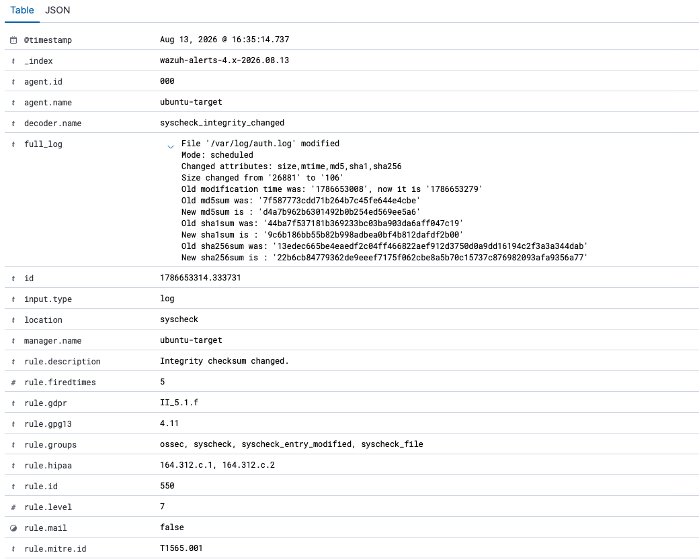

# Incident Report: Authentication Log Tampering

**Report ID:** INC-2026-08-13-01
**Classification:** Internal — Lab Exercise
**Framework:** NIST SP 800-61 Rev 2, *Computer Security Incident Handling Guide* — withdrawn April 3, 2025 and superseded by [Rev 3](https://doi.org/10.6028/NIST.SP.800-61r3); cited here as the historical basis for this report's structure. See [`CSF_MAPPING.md`](CSF_MAPPING.md) for this report mapped to CSF 2.0.
**Severity:** High
**Status:** Escalated — Pending L2 Investigation

---

## 1. Executive Summary

On August 13, 2026, the authentication log (`/var/log/auth.log`) on `ubuntu-target` was deliberately truncated to near-zero size using an already-established shell session. This exercise is scoped from the premise that the operator already holds valid shell access to the host — the incident begins at the point of evidence tampering, not at initial access. File Integrity Monitoring (FIM) detected the change on the next scheduled scan, generating a genuine rule 550 alert with full before/after hashes and, critically, a complete diff of the destroyed content — meaning the tampering attempt did not succeed in permanently erasing the evidence, only the live copy on disk. Because deliberate log clearing by an actor with existing access is a strong indicator of deliberate, technically capable malicious activity intended to conceal other actions, this incident is assessed as High severity and escalated to SOC Tier 2 to determine what the operator was attempting to hide.

## 2. Timeline of Events

All times local (EDT), sourced directly from the Wazuh FIM alert and the host's own filesystem metadata — not estimated.

| Time | Event | Source |
|---|---|---|
| 16:30:08 | Last known-good state of `auth.log` (26,881 bytes) | FIM alert, previous recorded modification time |
| 16:34:39 | `auth.log` truncated to 106 bytes via `sudo truncate -s 0` | Filesystem mtime, confirmed via `ls -la` |
| 16:35:14 | FIM scheduled scan detects the change; rule 550 alert generated | Wazuh alert, rule.id 550 |

The 35-second gap between the tampering action and detection reflects a deliberately shortened FIM scan interval (60 seconds, tuned specifically for this exercise) rather than Wazuh's 12-hour default — see Section 10 for the full detection-engineering rationale. This is an honest, disclosed caveat: the real Mean Time to Detect here is a property of this exercise's tuning, not a claim about default Wazuh behavior.

## 3. Indicators of Compromise

| Indicator | Value |
|---|---|
| Target file | `/var/log/auth.log` |
| Host | `ubuntu-target` |
| Command executed | `sudo truncate -s 0 /var/log/auth.log` |
| Size before → after | 26,881 bytes → 106 bytes |
| MD5 before → after | `7f587773cdd71b264b7c45fe644e4cbe` → `d4a7b962b6301492b0b254ed569ee5a6` |
| SHA1 before → after | `44ba7f537181b369233bc03ba903da6aff047c19` → `9c6b186bb55b82b998adbea0bf4b812dafdf2b00` |
| SHA256 before → after | `13edec665be4eaedf2c04ff466822aef912d3750d0a9dd16194c2f3a3a344dab` → `22b6cb84779362de9eeef7175f062cbe8a5b70c15737c876982093afa9356a77` |
| Residual content | One PAM session-close line remained post-truncate |

The residual content is a genuinely interesting indicator in its own right: even a maximally minimal anti-forensic action (`truncate -s 0`) could not produce a perfectly empty file, because escalating via `sudo` to perform the truncation itself generated a PAM session-close event that was written into the file being cleared — a real, self-defeating property of this specific technique that a less minimal cleanup pass (e.g. deleting and recreating the file entirely) might not exhibit.

## 4. MITRE ATT&CK Mapping

| Technique | ID | Tactic | Source |
|---|---|---|---|
| Disable or Modify Tools: Clear Linux or Mac System Logs | T1685.006 (reissued from T1070.002 under ATT&CK v19) | Defense Impairment | Scenario intent |
| Stored Data Manipulation | T1565.001 | Impact | Wazuh's automatic rule 550 tag |

These two mappings genuinely differ, and that gap is itself worth documenting rather than silently reconciling. Wazuh's rule 550 is a generic, content-agnostic integrity-change rule — it fires identically whether a file was tampered with to destroy evidence, corrupted by an application bug, or edited for a legitimate reason, and its default MITRE tag (T1565.001) reflects only "something in a tracked file changed," not attacker intent. Determining that this specific change is actually deliberate log clearing requires an analyst applying context (which file, what changed, who ran the command) — a real, general limitation of generic FIM alerting that a Tier 1 analyst needs to know rather than assume the tool's auto-tag is authoritative.

## 5. Triage & Severity Assessment

**Severity: High.** Unlike a typical integrity-change alert, this one carries specific weight because of what the target file's role implies: `auth.log` is the record of exactly the kind of activity a SOC would need to reconstruct what an intruder did. An actor with legitimate-looking shell access deliberately clearing this specific file, rather than any other, is a strong signal of deliberate, security-aware behavior — not an accidental change or routine administration. In real environments, this class of action typically indicates an actor is actively trying to conceal other activity that may be more consequential than the log-clearing itself.

**Initial (Tier 1) validation performed before escalation:**
- Confirmed the size and hash changes via the FIM alert's own before/after fields, not assumed from the alert firing alone.
- Reviewed the alert's `syscheck.diff` field directly to confirm exactly what content was destroyed, rather than treating the alert as a bare notification.
- Confirmed no other monitored file changed that day — all fifteen integrity-change alerts recorded on August 13 name `/var/log/auth.log` and no other path — narrowing the action to this single, deliberate target.

**Why this was not closed at Tier 1:** the target file and technique are specific enough to rule out routine administrative log rotation, which does not truncate a file in place to near-zero bytes. Tier 1 confirmed the *what*; determining *why* — what the operator was concealing — is outside Tier 1's scope.

## 6. Escalation Decision

**Escalated to SOC Tier 2.** Justification: deliberate evidence tampering by an actor with existing shell access is presumptively tied to concealing other activity, and Tier 2 investigation is needed to determine what that activity was — reviewing the destroyed content (preserved in the FIM diff, detailed in Section 7), correlating the operator's session against other log sources on this host and others in the environment for signs of related activity in the same window, and confirming whether other forensic artifacts (shell history, other log files) were similarly targeted.

## 7. Containment & Remediation Actions

This incident's containment differs meaningfully from a typical case: the "evidence" the operator attempted to destroy was independently preserved by the very detection layer they were trying to evade. The FIM alert's `syscheck.diff` field contains the destroyed content of `auth.log` — the diff header records 61 lines replaced by one, and the preserved text includes the operator's own session activity. Wazuh truncates this field beyond a size limit, so the record is substantial rather than complete: 27,122 characters against a 26,881-byte original, ending in a truncation marker. What it establishes unambiguously is the scale of what was destroyed and the fact that the live on-disk copy was not the only copy.

**Actions taken:**
- No file restoration was attempted on the live system — the on-disk file cannot be restored to its exact prior byte-for-byte state, and the SIEM-preserved diff already serves as the authoritative record for investigation purposes.
- FIM monitoring on `/var/log/auth.log` remains permanently in place going forward (added specifically to support this exercise — see Section 10) — meaning this exact technique is now durably detectable on this host, where previously it would not have been caught at all.

**Recommended for a production environment, not implemented in this lab:**
- Forward `auth.log` to a remote, append-only log collector in near-real-time, so that a successful local truncation can no longer destroy the authoritative copy — this defeats the technique at a more fundamental level than local FIM alone, since FIM only detects tampering after the fact rather than preventing loss of the live local copy.

## 8. Root Cause Analysis

**Deliberately out of scope, not unresolved.** This exercise's premise explicitly begins from an actor who already holds valid shell access — how that access was originally obtained is a separate question this incident does not model or investigate. A real Tier 2 investigation would need to trace backward from this point to identify the actual initial access vector, which is intentionally outside this report's scope rather than an evidence gap being glossed over.

## 9. Lessons Learned / Recommendations

- **A detection rule that's configured and a detection rule that actually alerts are two different things** — the same core lesson from this lab's very first detection rule (T1110), rediscovered here in a new form. Simply adding `auth.log` to FIM's watched paths was not sufficient on its own; getting a genuine, dashboard-visible alert required working through two distinct, real Wazuh behaviors (documented fully in Section 10) that would have silently defeated detection if left unaddressed.
- **Restart-triggered FIM scans do not generate alerts, even when they detect real changes.** This is a confirmed Wazuh bug ([issue #32426](https://github.com/wazuh/wazuh/issues/32426), filed October 2025 against 4.13.1, open at the time of this exercise and since closed) — an operational team relying on a manager restart to force detection would get a false sense of security from a silently-updated baseline instead of a real alert.
- **A generic FIM rule's automatic MITRE tag should not be trusted as the final word on attacker technique.** Rule 550 tags every integrity change identically (T1565.001); recognizing this specific instance as log clearing (T1685.006) required analyst judgment about which file changed and why, not just the tool's own label.
- **Centralizing high-value forensic logs off-host remains the more durable fix.** Local FIM caught this specific tampering attempt, but only after the fact — the live file was still genuinely destroyed on disk. Remote log forwarding would prevent the underlying loss, not just detect it after it happens.

## 10. Detection Engineering Notes: Building and Validating FIM Coverage

This section documents the real, multi-layered process required to get File Integrity Monitoring on `auth.log` working at all — included because the debugging arc itself is a genuine, worthwhile technical finding, not because a production incident report would normally contain it.

**1. FIM was not watching `auth.log` at all, and adding it wasn't enough on its own.** The default Wazuh configuration's `<syscheck>` block only covered `/etc`, `/usr/bin`, `/usr/sbin`, `/bin`, `/sbin`, and `/boot` — `/var/log` wasn't monitored in any form. Adding an explicit `<directories>` entry for the file was the first step, but not sufficient by itself.

**2. A global ignore rule was silently filtering it out.** Wazuh's default configuration includes `<ignore type="sregex">.log$|.swp$</ignore>` — a rule that applies globally across every monitored directory, with no way to scope an exception to one specific path (a confirmed, documented Wazuh limitation, not a misconfiguration). Since `auth.log` matches `.log$`, it was being silently excluded from tracking even while explicitly listed in `<directories>`. Confirmed empty of any other `.log` files across the watched directories first, then removed the `.log$` portion of the ignore pattern specifically, preserving the unrelated `.swp$` exclusion.

**3. Restart-triggered scans update the FIM database but never generate an alert.** This was the most consequential finding. Forcing detection via `systemctl restart wazuh-manager` — the approach used throughout most of this session's troubleshooting — re-baselined the file's hash against its current state instead of comparing it to the prior baseline and alerting on the difference. This behaviour is documented upstream in [Wazuh issue #32426](https://github.com/wazuh/wazuh/issues/32426), filed October 2025 against 4.13.1 and since closed. The exact sequence of attempts made here is not reconstructable from surviving evidence — the manager log no longer covers this date, and `ossec.conf`'s timestamp postdates the exercise — so this report claims only what the upstream issue documents and what the working configuration shows. The fix was switching to a genuinely scheduled scan (temporarily lowering `<frequency>` from the 12-hour default to 60 seconds for this exercise) rather than relying on any restart to trigger detection.

**4. A `realtime` + `restrict` alternative was attempted and abandoned.** Since `realtime` monitoring only applies to directories, not individual files, an attempt was made to watch `/var/log` in realtime while scoping actual tracking down to `auth.log` via the `restrict` attribute. This configuration was accepted without any parsing error, and syscheckd confirmed it was watching the path — but a change made after this config took effect was never picked up by a subsequent query of the FIM database at all. Given time already invested and a working alternative in hand, this path was abandoned in favor of the scheduled-scan approach rather than further diagnosed — a deliberate scoping decision, not a claim that the realtime approach cannot work.

**5. A validation check nearly reached a false conclusion, caught by looking one step further.** After enabling full debug logging (`analysisd.debug=2`, `syscheck.debug=2`) and tracing a test change all the way through syscheckd's log — confirming it sent a complete, correctly-formed FIM event — analysisd's own debug output showed no trace of processing that event at all for a full 61-second window, appearing to confirm a silently broken alert pipeline. Before finalizing that conclusion, a completely fresh, clean repeat of the actual incident action was performed as a final check — and it produced a real, complete rule 550 alert, fully visible on the dashboard, including the alert's own diff of the destroyed content. The likely explanation: normal indexer/Filebeat catch-up lag following several manager restarts earlier in the session, not a genuinely broken pipeline. The lesson carried into this report's own methodology: a negative result from limited-duration debug tracing is not the same as a proven absence, and re-testing cleanly before committing to a conclusion is worth the extra time.

## Appendix: Evidence Index

The two captures that source this report's central claims appear inline in Sections 3 and 7. All three are listed here:

| File | Shows |
|---|---|
| [`fim-alert-rule-550-summary.png`](screenshots/incident-02/fim-alert-rule-550-summary.png) | Full alert record — timestamp, rule ID, level, and the `full_log` field with size and hash changes *(shown inline in Section 3)* |
| [`fim-alert-rule-550-mitre-mapping.png`](screenshots/incident-02/fim-alert-rule-550-mitre-mapping.png) | Rule 550's automatic MITRE tag (T1565.001) and compliance mappings, alongside `syscheck.changed_attributes` — the basis for Section 4's note on generic auto-tagging |
| [`fim-alert-rule-550-diff.png`](screenshots/incident-02/fim-alert-rule-550-diff.png) | The `syscheck.diff` field containing the destroyed log content *(shown inline in Section 7)* |
